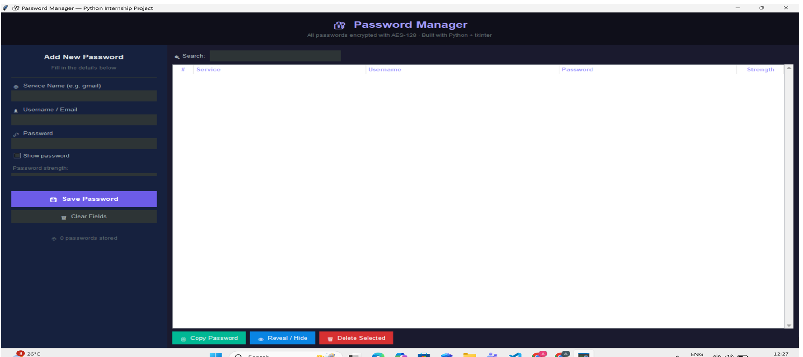
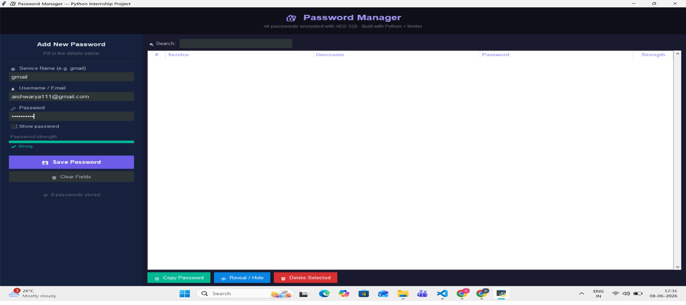
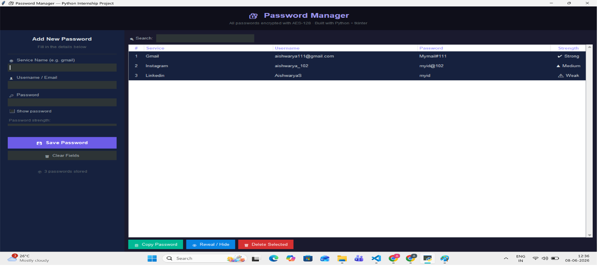
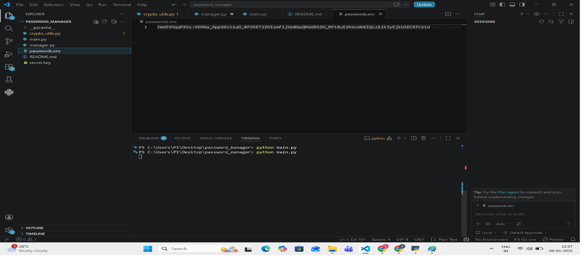

# 🔐 Password Manager with Encryption (GUI)

## Intern Details
- **Intern ID:** CITS1971
- **Full Name:** AISHWARYA S
- **No. of Weeks:** 4 Weeks
- **Project Name:** Password Manager(Encryption)
- **Week:** 4 Weeks

## Project Scope
A GUI-based password manager built in Python using tkinter.
Passwords are stored securely using Fernet (AES-128) symmetric
encryption. Features include adding, searching, revealing,
copying, and deleting passwords through a graphical interface.

## Project Structure
password_manager/
├── main.py          → GUI window (run this file)
├── manager.py       → Save/load/delete password logic
├── crypto_utils.py  → Encryption and decryption (AES-128)
├── passwords.enc    → Auto-created encrypted passwords file
├── secret.key       → Auto-created encryption key
└── README.md        → This file

## Tech Stack
- Language: Python 3.x
- GUI Library: tkinter (built-in)
- Encryption: cryptography library (Fernet / AES-128)
- Storage: JSON + Fernet encrypted binary file

## How to Run
Step 1 - Install dependency:
pip install cryptography

Step 2 - Run the program:
python main.py

## Features
- Add passwords with service name, username, and password
- Live password strength indicator (Weak / Medium / Strong)
- Show and hide password while typing
- Search passwords by service or username
- Reveal or hide passwords in the table
- Copy password to clipboard with one click
- Delete password with confirmation dialog
- All data encrypted with AES-128 Fernet encryption

## How Encryption Works
1. On first run, a random key is created and saved to secret.key
2. When saving, passwords are converted to JSON then encrypted
3. Encrypted bytes are saved to passwords.enc
4. On loading, the file is decrypted using the same key
5. Never share or delete secret.key - passwords cannot be recovered without it

## Screenshots
### 1. Main Window

### 2. Adding a Password

### 3. Password Table

### 4. Passwords Revealed

### 5. Encrypted File

